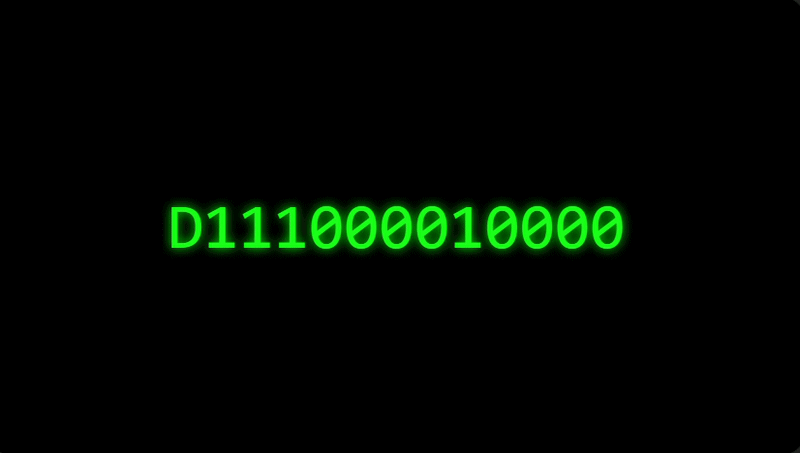

<h1 align="center">
  
</h1>

<h3 align="center">💻 Web Dev | 🔐 Security Learner | 🎮 Roblox Dev</h3>

  

---

## 🚀 About Me
- 🔭 I’m working on: Roblox + Web Projects  
- 🌱 Learning: Cyber Security / Bug Bounty  
- ⚡ Fun fact: I like breaking things (ethically 😈)

---

## 🛠 Skills

---

## 📂 Projects
- 🔐 Bug bounty practice (XSS, IDOR, API)
- 🎮 Roblox game systems (shop, GUI, RNG)
- 🌐 Personal website

---

## 📊 GitHub Stats

  
  

---

## 📫 Contact
- Discord: dungdev0489
- Email: levietdunf45@email.com
